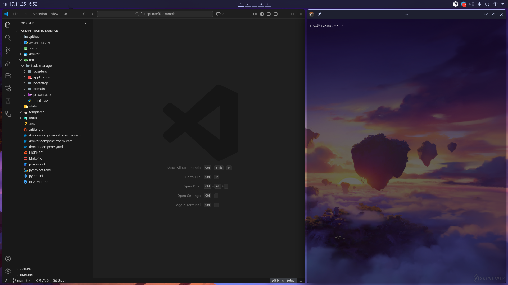
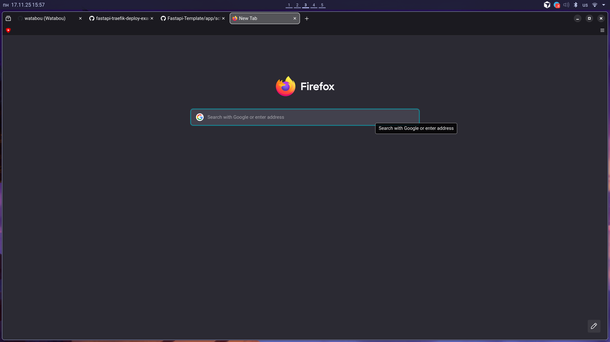
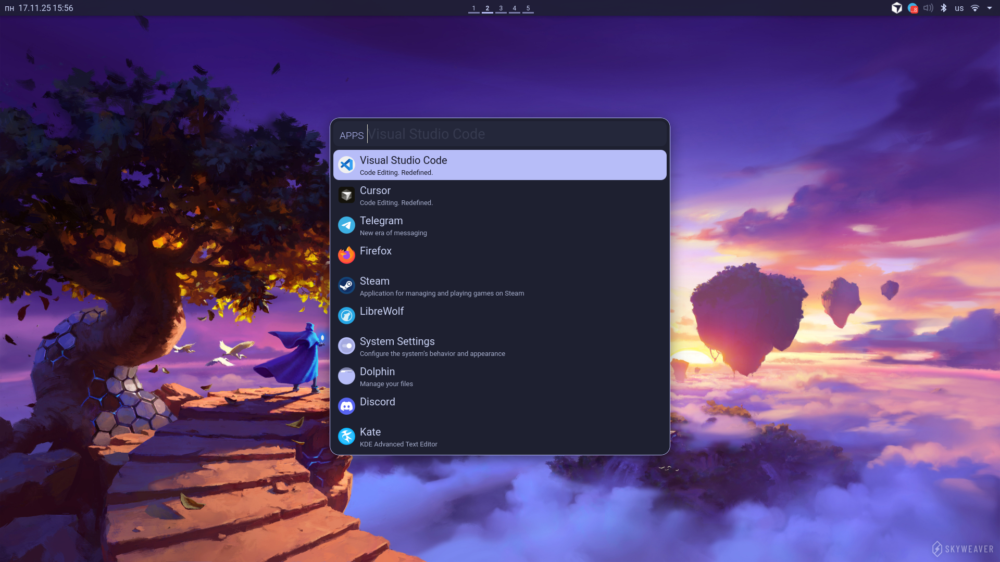

# My NixOS Config

## Installation

- Copy repo to ~/Documents/nix-config/nixos
- Replace hosts/default/hardware-configuration.nix with auto-generated /etc/nixos/hardware-configuration.nix

- Install nixos config:
`sudo nixos-rebuild switch --flake ~/Documents/nix-config/nixos#default`

- Install home-manager config:
`nix-shell -p home-manager`

`home-manager switch --flake ~/Documents/nix-config/nixos#default`

`exit`

## Thanks!

Config was made with parts from other configs:
- https://github.com/sund3RRR/sunderOS
- https://github.com/AlexNabokikh/nix-config

## Programs

os/programs updated: 11 november 2025

#### General

- Firefox + Librewolf
- Discord
- LibreOffice
- Steam + proton (Intel CPU / Nvidia GPU)
- Trillium
- zapret-discord-youtube
- OBS
- Telegram
- VLC player

#### Code

- Vscode + 2 profiles: for python and golang 
- Docker
- Python 3.13.9; 
- Postgres service + pgadmin4;
- Cursor app

#### zsh aliases

`python-shell` : starts python dev shell
`go-shell` : starts golang dev shell

# 

# 

# 
